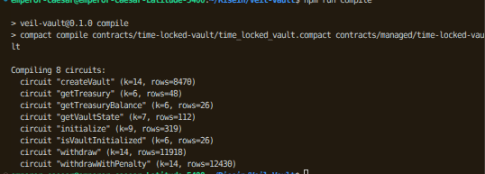
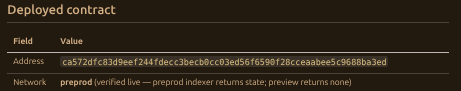

# VEIL Vault

[](https://github.com/ArtaXerxes-oss/Veil-Vault/actions/workflows/ci.yml)

**VEIL Vault** is a private, time-locked asset vault for the [Midnight](https://midnight.network) blockchain. It is Wave 1 of a fintech product loop: connect a real Midnight wallet (1AM/Lace), deploy and initialize a real **Compact** contract, create private vaults via a real `createVault` circuit call, and withdraw on time or exit early with a penalty.

The frontend talks directly to the live chain — no simulation. Balances and ownership live in Compact **private state**; commitments, vault counters, treasury, and lifecycle status are readable from the Midnight indexer.

> **Current deployment status:** a real contract is deployed on **preprod** and wired into the app by default. It is _deployed but not yet initialized_ — initialize it from the **Deploy** page (`#/deploy`) once you've connected your wallet.

---

## Product loop

1. Connect a Midnight wallet (1AM or Lace) on **preprod**.
2. **Deploy** the compiled `TimeLockedVault` Compact contract (or bind an existing address) and **initialize** a treasury.
3. **Create a vault** — pick an asset label, amount, unlock date/time, and withdrawal rule (`STRICT` or `PENALTY`). This submits a real `createVault` circuit call through your wallet (prove → balance → submit).
4. **Attempt an early strict withdrawal** and watch the contract reject it.
5. **Withdraw** after unlock, or exit a penalty vault early and pay `penaltyBps`.
6. See the vault become permanently withdrawn (`WITHDRAWN` / `PENALTY_EXECUTED`) and review its transaction history.

The visual layer is intentionally quiet and financial: sensitive values are shown as `PRIVATE` by default, while lifecycle state stays easy to inspect.

---

## Deployed contract

| Field    | Value                                                                                       |
| -------- | ------------------------------------------------------------------------------------------- |
| Address  | `ca572dfc83d9eef244fdecc3becb0cc03ed56f6590f28cceaabee5c9688ba3ed`                          |
| Network  | **preprod** (verified live — preprod indexer returns state; preview returns none)           |
| Status   | Deployed, **not initialized** (`initialized=false`, `treasury=0x00…00`, `vaultCounter=0`)   |
| Bound by | `.env.local` → `VITE_CONTRACT_ADDRESS` with a hardcoded fallback `DEFAULT_CONTRACT_ADDRESS` |

The address is bound automatically on startup (saved localStorage wins, then env, then the code fallback), so the **Deploy** page already shows it as the current contract. The only remaining step is **Initialize contract** — a real signed transaction that only your wallet can produce.

---

## Video Demo

[](https://youtu.be/dyCqXgBnkgE?si=vp7PBt19bv0XHSBc)

**Watch:** https://youtu.be/dyCqXgBnkgE?si=vp7PBt19bv0XHSBc — full product loop: wallet connect → deploy/initialize → createVault → strict/penalty withdraw.

---

## ScreenShot Of Compiled Contract



## ScreenShot Of Deployed Contract With Address



## Architecture

The app keeps two deliberately separate layers:

- **`src/lib/contract.ts`** — an executable reference model of the Wave 1 authority (validation, lock modes, penalty, treasury accounting, private-state tracking). Used by the test suite only.
- **`contracts/time-locked-vault/time_locked_vault.compact`** — the actual Compact contract: state declaration, circuits, and queries. The frontend never replaces contract enforcement with a UI-only timer.

The live integration path is:

```
pages → useVaultApp → src/lib/vaultContract.ts → quoted providers (midnight.ts)
                                              → compiled contract (contracts/managed/…/contract/index.js)
                                              → wallet / indexer / proof server
```

### Compact contract

- Source: `contracts/time-locked-vault/time_locked_vault.compact`
- Compiled output: `contracts/managed/time-locked-vault/time_locked_vault/contract/index.js`
- ZK assets (synced to `public/contract/time-locked-vault/`): prover/verifier + zkir for all 8 circuits — `initialize`, `createVault`, `withdraw`, `withdrawWithPenalty`, and queries `isVaultInitialized`, `getTreasury`, `getTreasuryBalance`, `getVaultState`.
- Witnesses (`contracts/time-locked-vault/witnesses.ts`) map the `VeilVaultPrivateState` fields: `secretKey`, `amount`, `ownerProof`, `nonce`, `penalty`, `currentTime`.
- Compiled with compact compiler `0.31.1` / language `0.23.0` / runtime **`0.16.0`**.

### SDK stack

`compact-js@2.5.1` (pinned), `compact-runtime@0.16.0`, `midnight-js-contracts@4.1.1`, `ledger-v8@8.1.2` (single copy via override), `testkit-js@4.1.1`, `wallet-sdk@1.1.0` (facade 4.0.1 / dust-wallet 4.1.0 / shielded 3.0.1), `wallet-sdk-address-format@3.0.0`.

---

## Toolchain

Verified on **2026-09-21** (Node `v22.22.0`, npm `10.9.4`, Linux x64).

### Compact toolchain (installed)

| Component                    | Version                                                                                            | Source / Notes                                                                                                              |
| ---------------------------- | -------------------------------------------------------------------------------------------------- | --------------------------------------------------------------------------------------------------------------------------- |
| `compact` wrapper            | `0.5.1`                                                                                            | `~/.local/bin/compact` (`compact --version`)                                                                                |
| Compact compiler (active)    | `0.31.1`                                                                                           | `compact list` → `→ 0.31.1 - x86_macos, aarch64_macos, x86_linux, aarch64_linux`                                            |
| Compact compiler (available) | `0.34.0`, `0.31.0`, `0.30.0`, `0.29.0`, `0.28.0`, `0.26.0`, `0.25.0`, `0.24.0`, `0.23.0`, `0.22.0` | `compact list`                                                                                                              |
| Compact language             | `0.23.0`                                                                                           | `contracts/managed/.../compiler/contract-info.json` → `language-version`                                                    |
| Compact runtime              | `0.16.0`                                                                                           | `contract-info.json` → `runtime-version` + `compact-runtime@0.16.0` + `contract/index.js` → `checkRuntimeVersion('0.16.0')` |
| `compactc` binary            | `0.31.1`                                                                                           | `~/.compact/versions/0.31.1/x86_64-unknown-linux-musl/compactc`                                                             |

### JS / Build toolchain (installed)

| Component                               | Version                                                               |
| --------------------------------------- | --------------------------------------------------------------------- |
| Node.js                                 | `v22.22.0`                                                            |
| npm                                     | `10.9.4`                                                              |
| TypeScript                              | `5.7.2`                                                               |
| Vite                                    | `5.4.11`                                                              |
| `@midnight-ntwrk/compact-js`            | `2.5.1` (exact pinned — `2.5.3` requires unpublished `ledger-v9`)     |
| `@midnight-ntwrk/compact-runtime`       | `0.16.0`                                                              |
| `@midnight-ntwrk/ledger-v8`             | `8.1.2` (deduped via override — `npm ls ledger-v8` shows single copy) |
| `@midnight-ntwrk/midnight-js-contracts` | `4.1.1`                                                               |
| `@midnight-ntwrk/testkit-js`            | `4.1.1`                                                               |
| `@midnight-ntwrk/ledger`                | `4.0.0`                                                               |

### Contract that compiles via `compact compile` (verified)

**Source:** `contracts/time-locked-vault/time_locked_vault.compact` (245 lines, `pragma language_version >= 0.20`, 8 circuits)

```bash
compact compile contracts/time-locked-vault/time_locked_vault.compact contracts/managed/time-locked-vault
# or
npm run compile   # → compact compile contracts/time-locked-vault/time_locked_vault.compact contracts/managed/time-locked-vault

# verified fresh 2026-09-21:
compact compile contracts/time-locked-vault/time_locked_vault.compact /tmp/veil-verify-compile
# => Compiling 8 circuits:  EXIT 0
# => /tmp/veil-verify-compile/{compiler,contract,keys,zkir}
```

**Output (matches `contracts/managed/time-locked-vault/time_locked_vault/`):**

| Artifact      | Location                           | Contents                                                                                                                                              |
| ------------- | ---------------------------------- | ----------------------------------------------------------------------------------------------------------------------------------------------------- |
| Contract JS   | `contract/index.js` + `index.d.ts` | `checkRuntimeVersion('0.16.0')`, `Ledger` + `Witnesses` + `Circuits` types                                                                            |
| Compiler info | `compiler/contract-info.json`      | `compiler-version 0.31.1 / language 0.23.0 / runtime 0.16.0`, 8 circuits + 5 witnesses + 12 ledger entries                                            |
| Keys          | `keys/*.prover` + `*.verifier`     | 16 files — `initialize`, `createVault`, `withdraw`, `withdrawWithPenalty`, `isVaultInitialized`, `getTreasury`, `getTreasuryBalance`, `getVaultState` |
| ZKIR          | `zkir/*.zkir` + `*.bzkir`          | 16 files — same 8 circuits                                                                                                                            |

**Circuits compiled (8):** `initialize` (k=9, 319 rows), `createVault` (k=14, 8470 rows), `withdraw` (k=14, 11918 rows), `withdrawWithPenalty` (k=14, 12430 rows), `getVaultState` (k=7, 112 rows), `isVaultInitialized` (k=6, 26 rows), `getTreasury` (k=6, 48 rows), `getTreasuryBalance` (k=6, 26 rows) — see `contracts/time-locked-vault/.circuit-info.json`.

> ZK assets are synced to `public/contract/time-locked-vault/` via `npm run sync:zk` for the wallet/proof server.

---

## Getting started

Requires Node.js **≥ 22**.

```bash
npm install
npm run dev            # syncs ZK assets, then starts Vite
```

Open the URL Vite prints (default `http://localhost:5173`).

### Environment

Create `.env.local` (git-ignored via `*.local`) and `.env`:

```ini
# .env.local — deployed contract bound on startup
VITE_CONTRACT_ADDRESS=ca572dfc83d9eef244fdecc3becb0cc03ed56f6590f28cceaabee5c9688ba3ed

# .env — default network for wallet.connect(...)
VITE_MIDNIGHT_NETWORK=preprod
```

Network (`preview | preprod | mainnet | undeployed`) must match the network selected inside your wallet extension. The wallet's `getConfiguration()` is the source of truth for node / indexer / proof-server endpoints at runtime.

### Wallet

Install and unlock **1AM** (recommended) or **Lace**. The app's wallet adapter lives in `src/contexts/WalletContext.tsx`. Connection approval is re-triggered on every connect click by design.

---

## Using the app

- **`#/`** — landing page.
- **`#/app`** — dashboard: real on-chain vaults, treasury address/balance, live status.
- **`#/create`** — new vault form. Editable at all times; the **submit button unlocks only when** you are connected, a contract is bound, _and_ the contract is initialized (targeted hints tell you which step is missing).
- **`#/deploy`** — deploy a new contract, bind an existing address, or **initialize the treasury** (fetches real state from the indexer).
- **`#/vault/:id`** — vault detail: status (`EMPTY` → `LOCKED` → `READY` → `WITHDRAWN` / `PENALTY_EXECUTED`), strict withdraw, early penalty exit.
- **`#/history`** — transaction log (deploys, initializes, creates, withdrawals) persisted to `localStorage`.

Private vault metadata (amount, nonce, secret key) is scoped per contract address under `veil-vault-private-meta-v1:<address>`. Withdrawals require the original private state, so they only work from the browser that created the vault.

---

## Project map

```text
contracts/time-locked-vault/         Compact source + witnesses
contracts/managed/time-locked-vault/ Compiled contract (index.js, keys, zkir)
public/contract/time-locked-vault/   Prover/verifier + zkir assets served to the wallet
src/App.tsx                          Hash-routed shell
src/pages/                           Landing, Dashboard, CreateVault, VaultDetails, History, Deploy
src/components/                      WalletButton, CreateVaultForm, TransactionStatus, VaultCard, VaultStatus
src/lib/                             useVaultApp, vaultContract (live), midnight (providers), contract (model), validation, format
src/contexts/WalletContext.tsx       1AM/Lace session + provider wiring
tests/                               Contract + validation Wave 1 tests
docs/                                architecture.md, privacy-model.md, threat-model.md
scripts/                             deploy.ts, setup.ts
```

---

## Verification

```bash
npm run typecheck     # tsc --noEmit
npm test              # builds src/lib/contract.ts via esbuild, runs node --test
npm run build         # tsc -b && vite build
npm run lint          # eslint src
```

Recompile the Compact contract / resync ZK assets:

```bash
npm run compile       # compact compile …/time_locked_vault.compact
npm run sync:zk       # copy keys + zkir into public/
npm run build:contract
```

### Verifying on-chain state (read path)

The app's real read path — `createPatchedPublicDataProvider` → `contractAction(address) { state ... }` → `ContractState.deserialize` → compiled `ledger()` — decodes the deployed contract as:

```json
{
  "initialized": false,
  "vaultCounter": 0,
  "treasuryBalance": "0",
  "treasury": "0000000000000000000000000000000000000000000000000000000000000000"
}
```

Indexer endpoints (2026): `https://indexer.<preprod|preview|mainnet>.midnight.network/api/v4/graphql` (WebSocket at `/api/v4/graphql/ws`).

---

## Important engineering notes

- **Ledger-v8 dedupe (`_CostModel` error).** The old `expected instance of _CostModel / expected instance of ChargedState` runtime errors came from two `@midnight-ntwrk/ledger-v8` copies (8.1.2 top-level + 8.1.0 nested under `midnight-js-protocol`). Fixed with an npm override forcing the nested copy to **8.1.2**:

  ```json
  "overrides": { "@midnight-ntwrk/midnight-js-protocol": { "@midnight-ntwrk/ledger-v8": "8.1.2" } }
  ```

  After changing overrides, delete `node_modules` **and** `package-lock.json`, then `npm install` fresh. Verify with `npm ls ledger-v8` (must show a single `@midnight-ntwrk/ledger-v8@8.1.2`).

- **`compact-js` is pinned to exact `2.5.1`.** `2.5.3` depends on the unpublished `@midnight-ntwrk/ledger-v9@^0.1.0-alpha.1`, which makes `npm install` fail with `ETARGET`. Do not bump it.

- **Build target.** `vite-plugin-top-level-await` was removed from `vite.config.ts` and devDependencies: it crashed on `@swc/core` ("missing field `type`" in `printSync`). `build.target: "esnext"` already enables native top-level await output.

- **`Invalid Transaction: Custom error: 182`** = `TransactionApplicationError` in Midnight — the intent's TTL expired, or the same intent was submitted twice. Ensure the wallet is synced to the tip, and don't double-submit. Both preprod and preview run ledger `8.1.2` as of Sept 2026.

- **`import.meta.env` is guarded** in `src/lib/midnight.ts` (`DEFAULT_CONTRACT_ADDRESS`) so the module can also be imported under plain Node (scripts/probes), where Vite's `import.meta.env` is `undefined`.

- A `Buffer` polyfill is registered in `src/main.tsx` for legacy SDK paths.

---

## Privacy & security model

### Public state vs Private witness

Midnight's Compact separates **on-chain ledger** (public, indexer-readable) from **witnesses** (private, proof-only). VEIL Vault uses both every circuit.

**Public ledger (`export ledger` in `contracts/time-locked-vault/time_locked_vault.compact:17`) — visible on-chain via indexer at `public/contract/time-locked-vault/` / GraphQL `state`:**

| Ledger field | Type | Disclosure | Visibility |
|---|---|---|---|
| `initialized` | `Boolean` Cell | `disclose()` in `initialize` | Public — `isVaultInitialized()` query |
| `vaultCounter` | `Counter` | `increment(1)` | Public — monotonic id |
| `treasury` | `Bytes<32>` Cell | `disclose(treasuryAddr)` | Public — `getTreasury()` |
| `treasuryBalance` | `Uint<128>` Cell | `+ disclose(penalty)` | Public — `getTreasuryBalance()` |
| `ownerPublicKey` | `Bytes<32>` Cell | `disclose(deriveKey(ownerSecret))` in `constructor:68` | Public commitment, secret never leaves witness |
| `vaultOwner` | `Map<Uint<64>, Bytes<32>>` | `disclose(ownerPublicKey)` per vault | Public — owner commitment per id |
| `vaultAmount` | `Map<Uint<64>, Uint<128>>` | `disclose(amt)` where `amt == vaultAmountPrivate()` | Public in Wave 1 (Wave 2 moves to committed-only) |
| `vaultUnlockTime` | `Map<Uint<64>, Uint<64>>` | `disclose(unlockTime)` | Public — unlock policy |
| `vaultLockType` | `Map<Uint<64>, Uint<8>>` | `disclose(lockType)` (`0`=STRICT, `1`=PENALTY) | Public |
| `vaultPenaltyBps` | `Map<Uint<64>, Uint<16>>` | `disclose(penaltyBps)` | Public |
| `vaultState` | `Map<Uint<64>, VaultState>` | `LOCKED → WITHDRAWN / PENALTY_EXECUTED` | Public lifecycle — `getVaultState()` |
| `vaultTermsCommitment` | `Map<Uint<64>, Bytes<32>>` | `disclose(persistentCommit([amt, unlockTime, lockType, penaltyBps], nonce))` | Public commitment, preimage private |

All reads go through `createPatchedPublicDataProvider → contractState → ContractState.deserialize → ledger()` — no private field is ever `lookup()`'d without `disclose()` gating.

**Private witnesses (`witness` in `time_locked_vault.compact:36` + `contracts/time-locked-vault/witnesses.ts:4`) — stored only in `VeilVaultPrivateState` (browser `veil-vault-private-meta-v1:<address>`, never on-chain):**

| Witness | `VeilVaultPrivateState` field | Used in | Role |
|---|---|---|---|
| `ownerSecret(): Bytes<32>` | `secretKey` | `constructor`, `createVault`, `withdraw`, `withdrawWithPenalty` | Private key → `deriveKey(sk)=persistentHash([pad("veil:vault:key"), sk]):47` → `ownerPublicKey`; `assert(deriveKey(ownerSecret)==vaultOwner.lookup)` proves ownership without revealing `sk` |
| `vaultAmountPrivate(): Uint<128>` | `amount` | `createVault` | Asserts `amt == amount:105` then committed + disclosed; binds private intent to public `vaultAmount` |
| `vaultNonce(): Bytes<32>` | `nonce` | `createVault`, `withdraw`, `withdrawWithPenalty` | Random 32B for `persistentCommit<Vector<4,Bytes<32>>>([amt, unlockTime, lockType, penaltyBps], nonce):108` → `vaultTermsCommitment`; recomputed on withdraw to prove terms unchanged |
| `vaultPenalty(): Uint<128>` | `penalty` | `withdrawWithPenalty` | `assert(penalty*10000==amount*penaltyBps)` (early) or `==0` (unlocked):210 → `treasuryBalance += disclose(penalty):215` |
| `currentTime(): Uint<64>` | `currentTime` | `createVault`, `withdraw`, `withdrawWithPenalty` | `assert(unlockTime > currentTime())` on create, `assert(currentTime() >= unlockTime)` on withdraw |
| `ownerProof(): Bytes<32>` | `ownerProof` (reserved) | declared `witness ownerProof(): Bytes<32>:38` | Reserved for future N-of-M / delegated proof (not consumed in Wave 1 circuits) |

**How the proof ties them:**

```text
createVault:  private (secretKey, amount, nonce, currentTime)
              → deriveKey + persistentCommit → disclose() → public ledger
              → ZK proof: "I know sk/nonce s.t. commitment opens and time is valid"
withdraw:     private (secretKey, nonce, currentTime)
              → recompute commitment, check deriveKey == vaultOwner, check time ≥ unlock
              → disclose() state transition LOCKED → WITHDRAWN
withdrawWithPenalty:
              private (secretKey, nonce, penalty, currentTime)
              → same owner + commitment check + penalty arithmetic proof
              → disclose(penalty) funds treasury, disclose(ownerPayout) returns to caller
```

> **UI `PRIVATE` masking is not the privacy.** The frontend shows `PRIVATE` by default for product clarity, but real privacy is the witness never hitting the ledger. See `docs/privacy-model.md:5` for visibility table and `docs/threat-model.md:30` for leakage defenses.

### What an observer can and cannot learn

An **observer** = anyone with the contract address + Midnight indexer/GraphQL (`indexer.preprod.midnight.network/api/v4/graphql`) — no wallet, no private state, no proof.

**Can learn (public ledger — `disclose()`'d on-chain):**

| Can see | Example value | Where |
|---|---|---|
| Contract is initialized | `initialized=true/false` via `isVaultInitialized()` | `time_locked_vault.compact:17` |
| How many vaults exist | `vaultCounter=3` | Counter query |
| Treasury address + balance | `treasury=0x…`, `treasuryBalance=250` via `getTreasury/getTreasuryBalance` | Public settlement accounting |
| Per-vault lifecycle | `vaultState[42]=LOCKED` via `getVaultState(42)` | Anyone can track state machine `EMPTY→LOCKED→WITHDRAWN/PENALTY_EXECUTED` |
| Per-vault policy | `vaultUnlockTime[42]=1735689600`, `vaultLockType[42]=1`, `vaultPenaltyBps[42]=500` | Public time-lock/penalty terms |
| Per-vault owner commitment | `vaultOwner[42]=0x9f…` | Commitment, not the secret — only the 32B `persistentHash([pad("veil:vault:key"), secretKey])` |
| Per-vault terms commitment | `vaultTermsCommitment[42]=0xab…` | `persistentCommit([amount, unlockTime, lockType, penaltyBps], nonce)` — checks integrity, but preimage hidden |
| Amount (Wave 1 only) | `vaultAmount[42]=1000` | **Wave 1 discloses amount** (`disclose(amt):120`) — Wave 2 will move this to commitment-only |

An observer watching the indexer sees: *"Vault #42 is LOCKED, penalty vault, unlocks 2025-12-31, owned by commitment 0x9f…, terms hash 0xab…"* — but nothing else.

**Cannot learn (private witnesses + local storage — never on-chain):**

| Cannot see | Why | Location |
|---|---|---|
| `secretKey` (`ownerSecret`) | Only witness, `deriveKey` hashes it — raw 32B never `disclose()`'d | `witnesses.ts:14` → `VeilVaultPrivateState.secretKey` |
| `nonce` preimage | Only inside `persistentCommit` preimage — observer sees only 32B hash | `witnesses.ts:22` |
| Linkage of `vaultTermsCommitment` to its fields without nonce | Commitment is hiding — need `nonce` + all 4 fields to recompute | `time_locked_vault.compact:108` |
| `ownerProof` delegation material | Reserved witness not yet used | `witness ownerProof:38` |
| Browser-local amount/nonce pairing | Stored under `localStorage: veil-vault-private-meta-v1:<address>` — per-browser, deleted if cleared | `src/lib/vaultContract.ts` |
| Who the owner commitment belongs to | `vaultOwner` is a hash, no on-chain mapping to wallet address — only holder of `secretKey` can produce `assert(deriveKey(secret)==owner)` on withdraw | `withdraw:146` + `withdrawWithPenalty:186` |

**Concrete example — vault #2 created via `createVault(2, 1000, 1735689600, 1, 500)`:**

```text
Observer sees on indexer:  vaultOwner[2]=0x9f…, vaultAmount[2]=1000, vaultState[2]=LOCKED, vaultTermsCommitment[2]=0xab…, unlock=1735689600
Observer cannot see:       secretKey=0x12… (32B), nonce=0x77… (32B), that 0xab… = Commit([1000,1735689600,1,500], 0x77…)
Withdraw proof:            prover locally injects secretKey+nonce+currentTime, recomputes 0xab… and deriveKey, ZK verifier checks equality — no secret leaves browser
Penalty case:              observer sees treasuryBalance +50 after early withdraw, but never sees penalty preimage 50 derived as amount*penaltyBps/10000 inside private witness
```

- Wave 1 intentionally does **not** move tokens: the asset field is a label, and the treasury is a random locally-generated 32-byte key. Real Dust/token transfer and shielded balances are pipeline items.
- The wallet approval flow re-triggers per action; the app never holds signing keys. Private state is scoped per contract address (`veil-vault-private-meta-v1:<address>`) — withdrawals only work from the browser that created the vault.
- **Wave 2 privacy hardening:** `vaultAmount` will no longer be `disclose()`'d — observer will see only `vaultTermsCommitment`. Amount privacy then matches `docs/privacy-model.md:11` ("Amount | Private").

See `docs/architecture.md`, `docs/privacy-model.md`, and `docs/threat-model.md` for details.

---

## Roadmap

### Wave 2 — real value on real value rails

- **tDUST/DUST deposits backed by shielded balances** — replace the asset _label_ with actual token
  transfers built on Midnight's shielded-balance primitives (dust-wallet / shielded sync), so a vault's
  amount is measurable in real value.
- **Encrypted unlock secrets instead of timestamps alone** — pair the time-lock with an encrypted secret
  the owner (and later executors) can reveal, enabling time- _or_ secret-based release.
- **Commitment scheme hardening** — amounts and ownership move fully into ZK commitments (nonce-seeded
  `amountCommitment` style) so the public ledger proves membership without disclosing value; only
  lifecycle events stay public.
- **UX for pending/unconfirmed intents** — visible in-flight states (proving, balancing, submitted),
  retry and failure recovery around the conservative TTL handling, so users never double-submit.
- **Lifecycle extension** — richer state machine (`DEPOSITING → COMMITTED → LOCKED → RELEASABLE →
SETTLED`) and per-vault configuration (grace periods, penalty curves), each transition a distinct
  Compact circuit.

### Wave 3 — escrow, inheritance custody, audit

- **Group escrow** — the time-lock vault becomes multi-party escrow: N-of-M approvers with per-party
  commitments, deadline-arbitrated release, and dispute refunds, all enforced in Compact circuits, not
  by the app.
- **Multi-signature time-lock custody** — multiple keyholders required to remove/revoke funds, combined
  with beneficiary recipient revocation for inheritance-style vaults.
- **Testing discipline** — contract-level testkit-js suites for every circuit (happy path, boundary
  timestamps, penalty math, failed assertions, replay/nonce reuse) executed against preview before any
  patch ships, plus property tests for lifecycle invariants.
- **Audit & mainnet** — formal review of the Compact contracts and witness handling, then the audited
  contract deployed to mainnet.

---

## Reference repos

- **Create Midnight App** — scaffolding and deployment structure
- **Midnight Escrow** — asset-locking / state-machine architecture (`EMPTY → LOCKED → READY → WITHDRAWN → PENALTY_EXECUTED`)
- **Example ZK Loan** — private financial state and ZK validation patterns
- **Midnight Local Dev** — local network/testing environment
- **Midnight Wallet SDK** — wallet and transaction functionality
- **OpenZeppelin Compact Contracts** — reusable Compact primitives
- **Compact Tools** — compile and build tooling
- **Midnight Doctor** — environment/version validation
